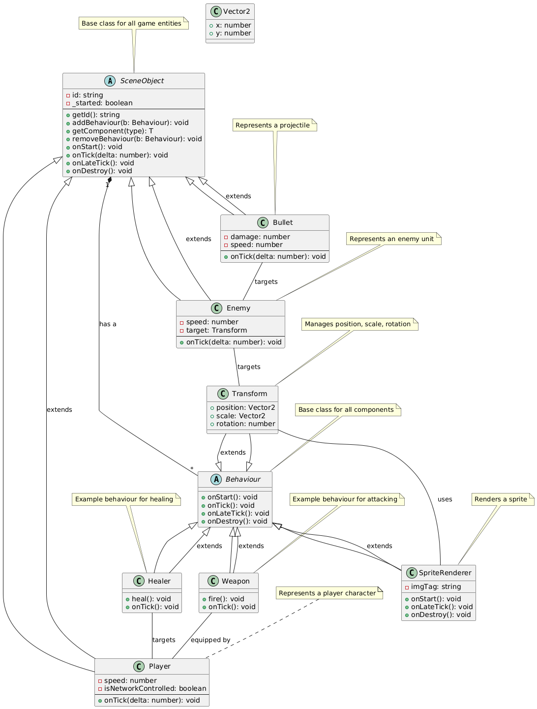

## Task 1: Requirements and Subsystems - Subsystem Overview

### Functional Requirements

*   **LAN Multiplayer:**
    *   **Host Game:** The system shall allow one player to host a new game on the local network.
    *   **Join Game:** The system shall allow other players on the same local network to discover and seamlessly join the hosted game.
    *   **Real-time Synchronization:** The system shall ensure that the game state is synchronized across all connected players in real-time, minimizing discrepancies and ensuring a consistent experience.
*   **Core Gameplay (Tower Defense Mechanics):**
    *   **Enemy Waves:** The system shall generate and manage waves of enemies that players must defend against.
    *   **High Enemy Count:** The system shall support the rendering and processing of a large number of enemies on screen simultaneously, up to a few hundreds, without significant performance degradation.
    *   **Tower/Artillery Placement:** The system shall allow players to strategically place towers/artillery on designated areas of the map to defend against enemy waves.
    *   **Tower/Artillery Upgrades:** The system shall allow players to upgrade their placed towers/artillery to increase their damage output, range, or other relevant attributes.
    *   **Avatar Abilities:** The system shall provide each player with a unique avatar possessing distinct abilities that can be activated to aid in defense.
*   **Progression & Unlocks:**
    *   **Level-Based Artillery Unlocking:** The system shall unlock new artillery types for players as they progress through the game, either through completing levels or reaching specific milestones.
    *   **Diverse Artillery Units:** The system shall feature a variety of artillery units with differing attributes (e.g., damage type, range, attack speed) and strategic uses.

### Non-Functional Requirements

*   **Performance:** The game shall maintain a stable frame rate (e.g., 60 FPS) on typical PC, even with a large number of enemies on screen, to ensure a smooth and responsive gameplay experience.
*   **Scalability:** The game shall support a reasonable number of players (e.g., 4-8) without significant performance degradation or network latency.
*   **Usability:** The game shall have a clear and intuitive user interface, making it easy for players to learn and play, regardless of their experience with tower defense games.
*   **Reliability:** The game shall be stable and reliable, with minimal crashes, network disconnects, or other unexpected errors, to ensure a consistent and enjoyable experience.
*   **Maintainability:** The codebase shall be well-structured, documented, and easy to understand, allowing for future updates, bug fixes, and feature additions.
*   **Responsiveness:** The game shall respond quickly to player input, with minimal delay between actions and their effects on the screen, providing a responsive and engaging experience.

### Subsystems Overview

#### 1. Scene and GameObjects Subsystem

*   **Role:** Provides the foundation for creating and managing game scenes and entities, abstracting away the underlying Phaser.js framework.
*   **Functionality:**
    *   **Scene Management:** Allows for the creation of new scenes by extending the `BaseScene` class, which in turn extends `Phaser.Scene`. This provides a structured way to manage different game states (e.g., main menu, game world).
    *   **Entity-Component System (ECS) (Emulated):** Defines entities and their behavior through composition, where each entity (actor) is a `SceneObject` with a collection of `Behaviour` components attached. This promotes modularity and reusability.
    *   **Phaser.js Abstraction:** Acts as an abstraction layer on top of Phaser.js, minimizing direct dependencies on the framework in other parts of the codebase.
*   **Key Classes:** `BaseScene`, `SceneObject`, `Behaviour`, `Transform`, `SpriteRenderer`
*   **Rationale:** This design choice allows easier migration to a different game engine (e.g., Unity, Godot, Bevy) in the future.

#### 2. Input Subsystem

*   **Role:** Manages player input from both keyboard and gamepad, providing a unified interface for other systems to access input data.
*   **Functionality:**
    *   **Input Abstraction:** Exposes methods like `pointerAim`, `move`, etc., for accessing input data.
    *   **Multi-Device Support:** Handles input from both keyboard and gamepad using the Strategy pattern, allowing for seamless switching between input methods.
*   **Key Classes:** `InputManager`, `KeyboardControls`, `GamepadControls`, `IControls`

#### 3. Networking Subsystem

*   **Role:** Handles all network communication, including player connection, state synchronization, and input handling.
*   **Functionality:**
    *   **P2P Networking:** Uses WebRTC for peer-to-peer communication.
    *   **Server Authoritative:** The host is the authoritative server, responsible for managing the game state and sending updates to peers.
    *   **State Synchronization:** Periodically sends object state and transform data from the host to peers.
    *   **Input Handling:** Peers send their input to the host for processing.
*   **Key Components:** `NetworkManager` (singleton accessed via `netMan`), WebRTC implementation, state synchronization logic.

#### 4. Enemies Subsystem

*   **Role:** Manages the creation, behavior, and interaction of enemy units.
*   **Functionality:**
    *   **Entity-Component System (ECS) (Prototype):** Implemented using the Entity-Behavior system.
    *   **Targeting:** Enemies select the nearest player as their target.
    *   **State Machine:** Each enemy operates as a state machine with "follow" and "attack" states.
    *   **Collision Detection:** Uses Phaser.js physics for collision detection with bullets.
*   **Key Classes:** `BaseEnemy`, `EnemyManager`
*   **Future Considerations:** In a production environment, a data-oriented ECS architecture (similar to Bevy-rs) should be used for improved performance.

### 5. Player Subsystem

*   **Role:** Manages player characters, their movement, and their unique abilities.
*   **Functionality:**
    *   **Entity-Component System (ECS):** Implemented using the Entity-Behavior system.
    *   **Base Movement and Sync:** The base `Player` class handles player movement and network synchronization.
    *   **Role-Based Abilities:** Player abilities (e.g., healing) are implemented as separate `Behaviour` components, allowing for different player roles.
    *   **Weapon Handling:** Weapons are also added as `Behaviour` components, while bullets are separate `SceneObject` instances.
*   **Key Classes:** `Player`

## Task 2: Architecture Framework - Stakeholder Identification

Following the IEEE 42010 standard, we have identified the following stakeholders for the "LAN Defense" project, along with their key concerns and the viewpoints/views that address those concerns:

| Stakeholder          | Concerns                                                                                               | Viewpoints/Views                                                                                                                                     |
| :------------------- | :----------------------------------------------------------------------------------------------------- | :--------------------------------------------------------------------------------------------------------------------------------------------------- |
| Players              | Fun gameplay, stable performance, fair competition, easy to learn, engaging experience                 | Gameplay View, Performance View, Security View, Usability View                                                                                   |
| Developers           | Maintainable code, extensible architecture, easy to debug, clear documentation, reusable components     | Development View, Component View, Deployment View                                                                                                |
| Host Player          | Stable hosting, low resource usage, fair administration controls                                        | Deployment View, Performance View, Security View                                                                                                   |
| Project Manager      | On-time delivery, within budget, meeting requirements                                                  | Project Management View, Schedule View, Resource View                                                                                                |
| Testers              | Thorough test coverage, easy to identify bugs, clear bug reporting                                    | Testing View, Component View                                                                                                                       |

### Stakeholder Details

*   **Players:** Players are primarily concerned with having a fun and engaging gameplay experience. This includes fun and balanced gameplay mechanics, stable performance (high frame rate, low latency), fair competition (no cheating or exploits), ease of learning the game mechanics, and an engaging and rewarding progression system. These concerns are addressed by the Gameplay View, Performance View, Security View, and Usability View.

*   **Developers:** Developers are concerned with the maintainability, extensibility, and overall quality of the codebase. This includes maintainable and well-documented code, an extensible architecture that allows for easy addition of new features, easy debugging and troubleshooting, and reusable components and modules. These concerns are addressed by the Development View, Component View, and Deployment View.

*   **Host Player:** The host player has specific concerns related to hosting the game session, such as stable hosting with minimal performance impact on their machine, low resource usage to avoid impacting other applications, and fair administration controls to manage the game session. These concerns are addressed by the Deployment View, Performance View, and Security View.

*   **Project Manager:** The project manager is concerned with the overall success of the project, including on-time delivery, staying within the allocated budget, and meeting all defined requirements. These concerns are addressed by the Project Management View, Schedule View, and Resource View.

*   **Testers:** Testers are concerned with ensuring the quality and stability of the game through thorough testing. This includes thorough test coverage of all game features, easy identification and reproduction of bugs, and clear and concise bug reporting. These concerns are addressed by the Testing View and Component View.

### ADRs

#### ADR 1: Scene and GameObjects Subsystem

**Title:** Adopt Scene and GameObject Structure with Phaser.js Abstraction

**Context:**
We need a foundational structure for creating and managing game scenes and entities. We want to minimize direct dependencies on Phaser.js to allow for potential migration to a different engine in the future.

**Decision:**
We will adopt a Scene and GameObject structure where:

*   New scenes are created by extending the `BaseScene` class, which extends `Phaser.Scene`.
*   Entities and their behavior are defined through composition, with `SceneObject` acting as the base class and `Behaviour` components providing functionality.
*   This system will act as an abstraction layer on top of Phaser.js.

**Consequences:**

*   **Positive:**
    *   Provides a clear and organized structure for managing game scenes and entities.
    *   Reduces direct dependencies on Phaser.js, making future engine migration easier.
    *   Promotes code reusability and modularity through the component-based architecture.
*   **Negative:**
    *   Adds a layer of abstraction, which may introduce a slight performance overhead.
    *   Requires developers to learn the custom Scene and GameObject structure in addition to Phaser.js.

---

#### ADR 2: Input Subsystem - InputManager with Strategy Pattern

**Title:** Implement InputManager with Strategy Pattern for Multi-Device Support

**Context:**
We need to support multiple input devices (keyboard and gamepad) in a flexible and maintainable way.

**Decision:**
We will implement an `InputManager` class that uses the Strategy pattern to handle input from different devices.

*   The `InputManager` will expose methods like `pointerAim` and `move` for accessing input data.
*   `KeyboardControls` and `GamepadControls` classes will implement the `IControls` interface, providing device-specific input handling.
*   The `InputManager` will switch between these strategies based on the connected input devices.

**Consequences:**

*   **Positive:**
    *   Provides a unified interface for accessing input data, regardless of the input device.
    *   Easily supports new input devices by adding new `IControls` implementations.
    *   Promotes code reusability and testability.
*   **Negative:**
    *   Adds complexity compared to directly accessing input events.
    *   Requires careful management of input strategies to avoid conflicts.

---

#### ADR 3: Networking Subsystem - P2P with Server Authoritative Model

**Title:** Implement P2P Networking with Server Authoritative Model using WebRTC

**Context:**
We need to implement networking for the game, considering factors such as scalability, latency, and security.

**Decision:**
We will use a peer-to-peer (P2P) networking model with a server authoritative approach, leveraging WebRTC for communication.

*   One player will act as the host (server), responsible for managing the game state.
*   Peers will connect to the host and send their input.
*   The host will process the input, update the game state, and send updates to all peers.

**Consequences:**

*   **Positive:**
    *   Reduces server costs compared to a dedicated server architecture.
    *   Potentially lower latency for players due to direct connections.
*   **Negative:**
    *   Host player's machine bears the burden of server processing.
    *   Requires careful handling of security and cheat prevention.
    *   More complex implementation compared to client-server.

---

#### ADR 4: Enemies Subsystem - Entity-Behavior System

**Title:** Implement Enemies Subsystem using the Data oriented Entity Component System

**Context:**
We need to manage the creation, behavior, and interaction of enemy units in the game.

**Decision:**
We will not use the ECS pattern for managing enemies.

**Arguement:**
ECS is not a good choice for browser like environment simply because the optimizations provided by ECS require a lower level access to memory and threads. It is also not within our time constraints for the prototype.

**Consequences:**

*   **Positive:**
    *   Enables modularity.
    *   Provides better performance.
*   **Negative:**
    *   Hard to implement.

---

#### ADR 5: Player Subsystem - Entity-Behavior System

**Title:** Implement Player Subsystem using the Entity-Behavior System

**Context:**
We need to manage player characters, their movement, and their unique abilities in the game.

**Decision:**
We will use the Entity-Behavior system for managing players.

*   The `Player` class will extend `SceneObject` and have `Behaviour` components attached to it.
*   The base `Player` class will handle movement and network synchronization.
*   Player abilities (e.g., healing) and weapon handling will be implemented as separate `Behaviour` components.

**Consequences:**

*   **Positive:**
    *   Enables flexible character customization.
    *   Promotes code reusability and modularity.
*   **Negative:**
    *   Adds complexity compared to a monolithic player class.

## Task 3: Architectural Tactics and Patterns - Architectural Tactics

We plan to employ the following architectural tactics to address key non-functional requirements:

1.  **Manage Resources (Resource Pooling):**
    *   **Explanation:** Using object pools for frequently created and destroyed objects, such as bullets or enemy units. Instead of creating new objects each time they are needed, objects are retrieved from a pool of pre-allocated instances.
    *   **Addresses:** Performance, Scalability - Object pooling reduces the overhead of object creation and garbage collection, improving performance and allowing the game to handle more dynamic objects.

2.  **Maintain Interoperability (Abstraction):**
    *   **Explanation:** Using abstraction layers and well-defined interfaces, as seen with the `BaseScene` and `IControls` interfaces, to minimize dependencies on specific technologies or frameworks. This allows for easier migration to new technology.
    *   **Addresses:** Maintainability, Portability - Abstraction makes the code more modular and easier to maintain and reduces the effort required to port the game to a new platform or engine.

3.  **Composition over Inheritance:**
    *   **Explanation:** Favoring composition over inheritance when designing game entities and their behaviors. This involves creating objects by combining simpler, independent components rather than inheriting from a complex class hierarchy.
    *   **Addresses:** Maintainability, Flexibility - Composition leads to more modular, reusable, and testable code. It also reduces the risk of the "fragile base class" problem often associated with inheritance.

### Implementation Patterns

We are using the following design patterns in our architecture:

*   **Composition over Inheritance:** We favor composition over inheritance for creating game entities. A `SceneObject` is composed of multiple `Behaviour` components, each responsible for a specific aspect of the entity's behavior. This promotes modularity, reusability, and flexibility. For example, a `Player` object can have a `Transform` component for managing its position, a `SpriteRenderer` component for rendering its sprite, a `Weapon` component for attacking, and a `Healer` component for healing.

*   **Strategy:** We use the Strategy pattern in the `InputManager` to handle input from different devices (keyboard, gamepad). The `InputManager` uses the `IControls` interface to delegate input handling to either the `KeyboardControls` or `GamepadControls` class. This allows us to easily switch between different input methods without modifying the `InputManager` class, promoting code reusability and testability.

*   **Singleton:** The `NetworkManager` is implemented as a Singleton, ensuring that there is only one instance of the class and providing a global point of access to it. This provides a central point of control for managing network communication and ensures that all parts of the game use the same network connection.

*   **Factory:** We use the Factory pattern in the `GameObjectFactory` to create game objects received over the network. The `GameObjectFactory` uses the `ObjectFactory` interface and concrete factories (e.g., `PlayerFactory`, `EnemyFactory`, `BulletFactory`) to create objects based on their type. This decouples the object creation logic from the rest of the game code and allows us to easily add new object types without modifying the `NetworkManager` class.

*   **Data-Oriented Design (ECS):** For the Enemy Subsystem in production, we intend to use a data-oriented design (ECS) similar to Unity DOTS ECS. This involves organizing code around data and its transformations, rather than objects and their methods. This will improve performance by promoting data locality and cache-friendly access patterns. It also simplifies the design by separating data (Components) from logic (Systems). For example, the `TransformSystem` will iterate through all entities with a `TransformComponent` and update their positions. The `HealthSystem` will iterate through entities with a `HealthComponent` and apply damage.

### UML Diagrams and Subsystem Patterns

#### Scene Object Structure

 

This diagram illustrates the scene object structure. The key design choice here is composition over inheritance to implement new game objects. The `SceneObject` has a collection of `Behaviours` attached to it.

#### Input Subsystem

 

This diagram illustrates the input subsystem. The strategy pattern is used here to seamlessly switch between Keyboard and Gamepad.

#### Enemy Subsystem (ECS)

 

This diagram illustrates the intended architecture for the Enemy Subsystem in production. It uses a data-oriented ECS approach, where data (Components) is separated from logic (Systems) to improve performance and scalability.

#### Networking Subsystem

 

This diagram illustrates the networking subsystem. The Factory pattern is used to create new game objects based on the incoming network packets.

## Task 4

The prototype source code can be found [here](https://github.com/BharatSahlot/Team3_LANDefence/).

### Enemy Architecture Analysis: Current Prototype vs. Proposed ECS Design

The current prototype implements the Enemy Subsystem using an Entity-Behavior system. This approach involves creating `Enemy` objects that inherit from a base class (`SceneObject`) and have `Behaviour` components attached to them. While this approach is relatively simple to implement, it has limitations in terms of performance and scalability, especially when dealing with a large number of entities.

In contrast, the proposed ECS-based design aims to address these limitations by separating data (Components) from logic (Systems). In this design, entities are simply IDs that link together various components, and systems operate on these components to perform specific tasks. This data-oriented approach promotes data locality and cache-friendly access patterns, leading to improved performance.

#### Comparison Table

| Feature             | Current Prototype (Entity-Behavior) | Proposed ECS Design (Data-Oriented) |
| ------------------- | ----------------------------------- | ----------------------------------- |
| Data Organization   | Data and logic tightly coupled      | Data and logic decoupled             |
| Performance         | Limited scalability                | High scalability                     |
| Memory Access       | Scattered memory access            | Data locality, cache-friendly        |
| Code Complexity     | Simpler initial implementation      | More complex initial setup           |

#### Performance Quantification

In our prototype, we were able to simulate up to 500 enemies on screen simultaneously without experiencing any significant frame drops. The response time remained consistently around 24 milliseconds. This indicates that the current Entity-Behavior system is sufficient for a small number of enemy types and a limited number of entities. However, we only tested with one type of enemy, and the performance may degrade as we add more enemy types and increase the number of entities.

#### Trade-offs

The trade-offs between the current Entity-Behavior system and the proposed ECS design are as follows:

*   **Entity-Behavior:**
    *   **Pros:** Simpler initial implementation, easier to understand for small-scale projects.
    *   **Cons:** Limited scalability, tight coupling between data and logic, potential performance bottlenecks with a large number of entities and enemy types.
*   **ECS:**
    *   **Pros:** High scalability, improved performance due to data locality, greater flexibility and maintainability.
    *   **Cons:** More complex initial setup, requires a deeper understanding of data-oriented design principles.

Given the potential for a large number of enemies and the desire for a scalable and maintainable architecture, we believe that transitioning to the ECS-based design in production is the right choice.
